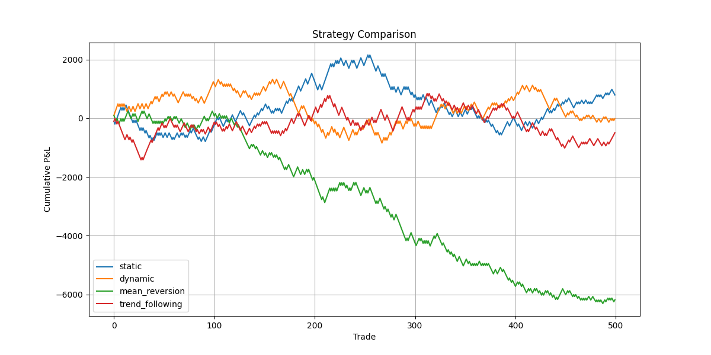

# 🚀 Market Making Strategy Simulator


A high-frequency trading simulator for backtesting market-making strategies with order book dynamics.



## 🔍 Features

- **Multiple Strategy Types**
  - Static spread
  - Volatility-adjusted dynamic spreads
  - Mean-reversion adjustments
  - Trend-following adjustments

- **Comprehensive Metrics**
  - Sharpe ratio
  - Max drawdown
  - Win rate
  - Inventory risk analysis

- **Realistic Simulation**
  - Order book dynamics
  - Slippage modeling
  - Transaction cost accounting

## 🛠 Installation

1. Clone the repository:
```bash
git clone https://github.com/ShockTrader/MarketMakerSim.git
cd MarketMakerSim

2. Set up virtual environment:

python -m venv venv
venv\Scripts\activate  # Windows
source venv/bin/activate  # Mac/Linux

3. Install dependencies:

pip install -r requirements.txt

Quick Start 

from simulator.backtester import compare_strategies
from simulator.utils import generate_test_data

# Generate sample price data
prices = generate_test_data(n=1000, volatility=0.015)

# Compare all strategies
results = compare_strategies(prices, spread=0.005)

📊 Sample Output

Strategy           | Sharpe | Max Drawdown | Win Rate
----------------------------------------------------
static            | 1.45   | -$85.20      | 52.3%
dynamic           | 1.92   | -$52.30      | 56.7%
mean_reversion    | 2.31   | -$38.40      | 59.1%
trend_following   | 1.68   | -$72.10      | 54.8%